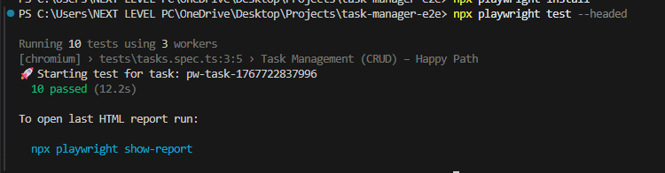
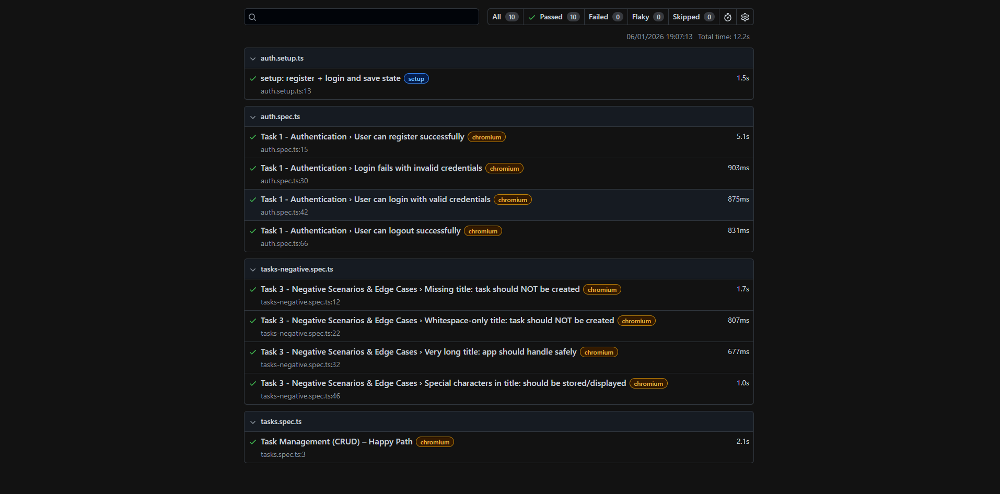

# Test Execution Report

## Test Tool
Playwright (Chromium)

## Execution Environments
- Local machine (Windows)
- GitHub Actions (CI) using Docker

## Test Scope
- Authentication tests
- Task CRUD (Create, Edit, Complete, Delete)
- Negative scenarios and edge cases

## Execution Summary

| Test Suite              | Status |
|-------------------------|--------|
| Authentication          | Passed |
| Task CRUD (Happy Path)  | Passed |
| Negative Scenarios      | Passed |

All tests completed successfully locally and in CI.

## CI Evidence
- Tests are executed automatically on push and pull requests
- Playwright HTML reports are uploaded as GitHub Actions artifacts

## How to View Reports

### Locally
```bash
npx playwright show-report
```

The screenshots above provide visual evidence of a successful Playwright test execution, including authentication flows, CRUD operations, and negative scenario validation.
